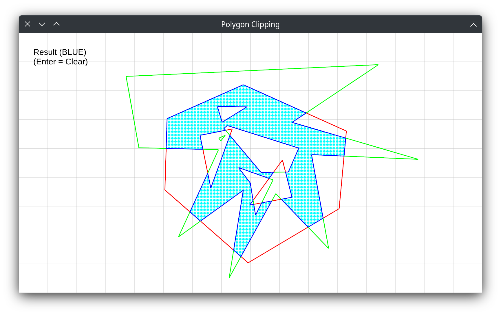

# PolygonClip

Homework 1 for *Computer Graphics* in School of Software, Tsinghua University.




## Compiling

```shell
cargo build
```

This will automatically download dependencies and build the program for your platform.

## Usage

1. Draw subject polygon
    - edges are counter-clockwise
    - when done, press enter for next step
2. Draw clipping polygon
    - when done, press enter for results
3. Results
    - Clipping results are marked with blue edges
    - Press enter again to clear the screen