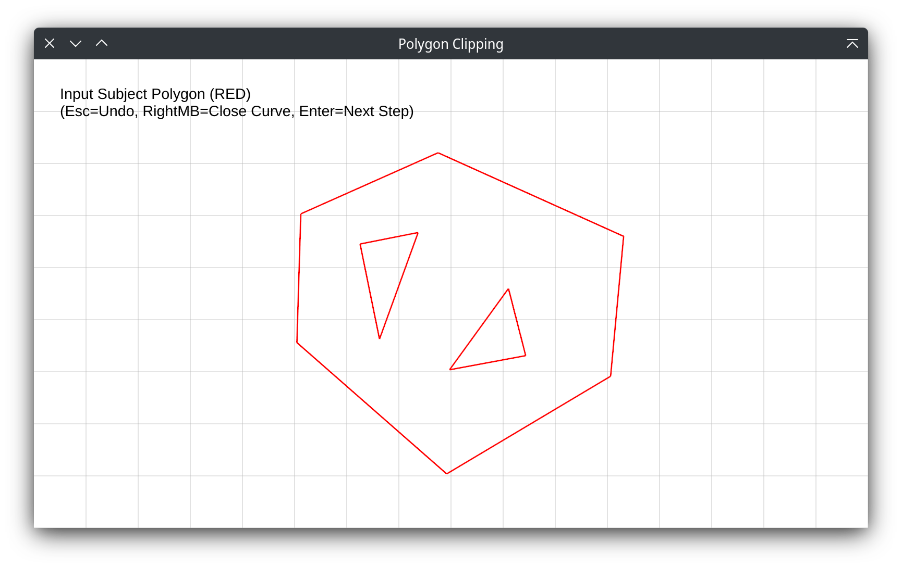
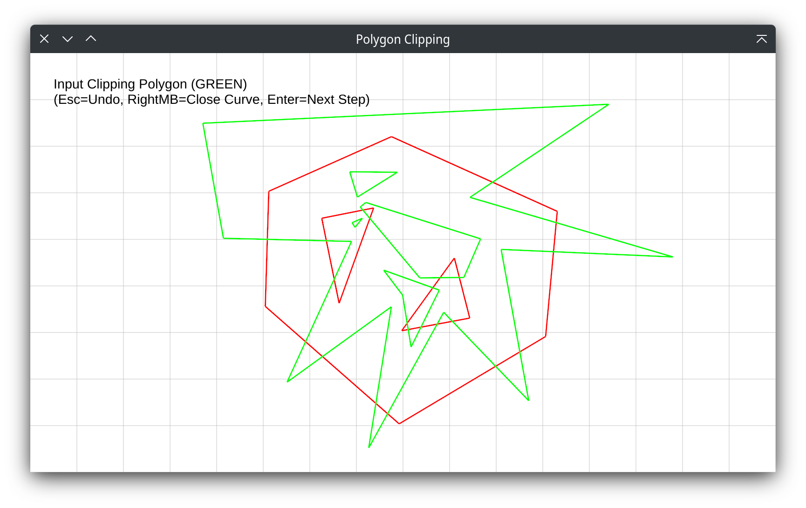

# 第一次作业报告

## 实验目的

学习实现多边形裁剪的 Weiler-Atherton 算法，并了解实现过程中可能遇到的问题。

## 实验方法

实现多边形裁剪算法（允许有内部环的复杂多边形）。

## 实验结果

实现了裁剪算法，示意图如下面的图1-3。






## 问题分析

1. W-A算法只处理了有交的情况，对于两个多边形没有交的部分（完全没有交，或者存在内环没有交）要特殊处理。
    - 首先根据W-A算法遍历有交的边，把遍历到的待裁剪多边形或裁剪多边形中的边作标记
    - 对没有标记的边集合，找出其中所有落在现有的结果多边形内的内环
    - 把环加入裁剪边集合
    - 特别地，如果全图都没有焦点，根据多边形内外关系进行特判
2. 判断内外环。根据边向量之间夹角求和得到。注意角度是有向角度，需要根据叉乘结果赋予相应符号。
3. 叉乘方向问题。所采用的绘制引擎x轴朝右但y轴朝下，因此顺时针方向才对应正的叉积，与一般的坐标系相反。
4. 判断线段A,B交点。需要作以下的分类讨论：
   1. 线段所在直线分别平行。
      - 如果直线距离0，就要判断是否相交。为此，判断线段A是否存在一个端点落在B上。
      - 如果直线距离非0，则一定不相交。
   2. 线段所在直线不平行。则延长线段A，看与B所在直线的交点是否落在B上。为此，联立两线段的向量表达式进行求解。

## 交互方式

进入程序时，处在等待输入待裁多边形的状态。首先输入逆时针的外环，然后输入若干顺时针内环。
（如果顺逆时针错误，程序会拒绝输入）在输入单个环时，可以按下鼠标中键或者ESC取消当前输入环。
输入的多边形显示为红色。
输入完成后，按下回车进入下一步。

下一步是输入裁剪多边形，输入方式同上，但是输入的多边形显示为绿色。输入完成后，按下回车查看结果。
裁剪结果的边为蓝色，内部为青色（采用画点函数着色）。
最后，按下回车清屏幕，重新开始下一次裁剪。

## 编译环境

采用 rustc 1.63.0 进行编译。编译需要首先安装 rust 环境，推荐使用 `rustup` 进行安装。

运行下列命令来编译并运行：

```shell
cargo run
```

此过程会自动下载所需的依赖，并且编译得到可执行文件。然后，即可进行裁剪实验。